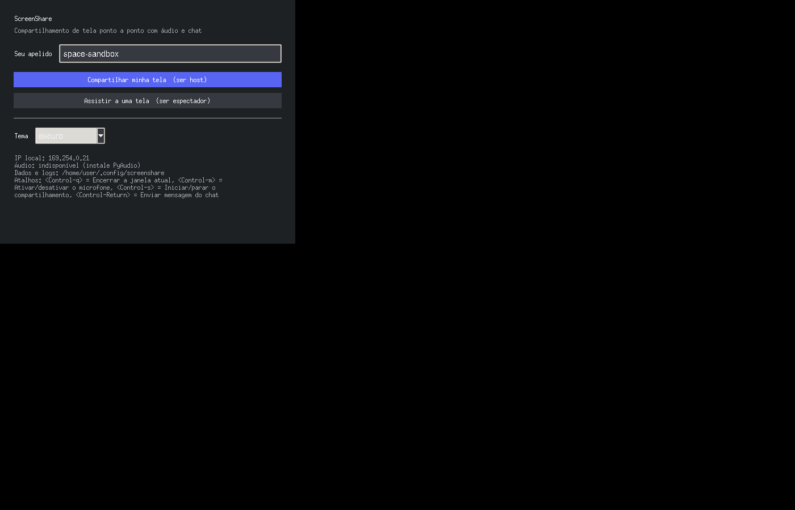
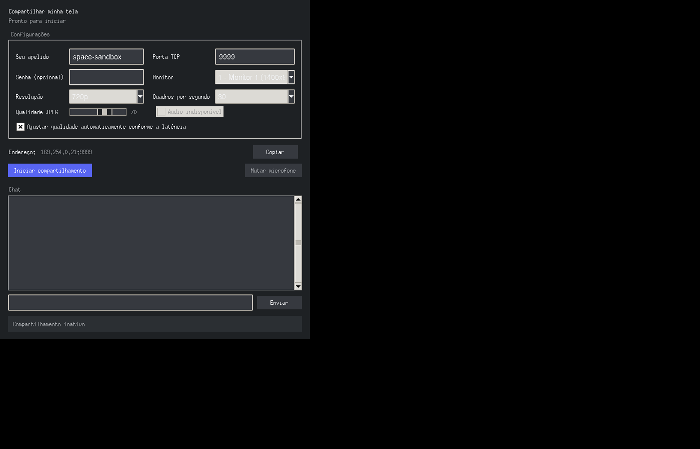
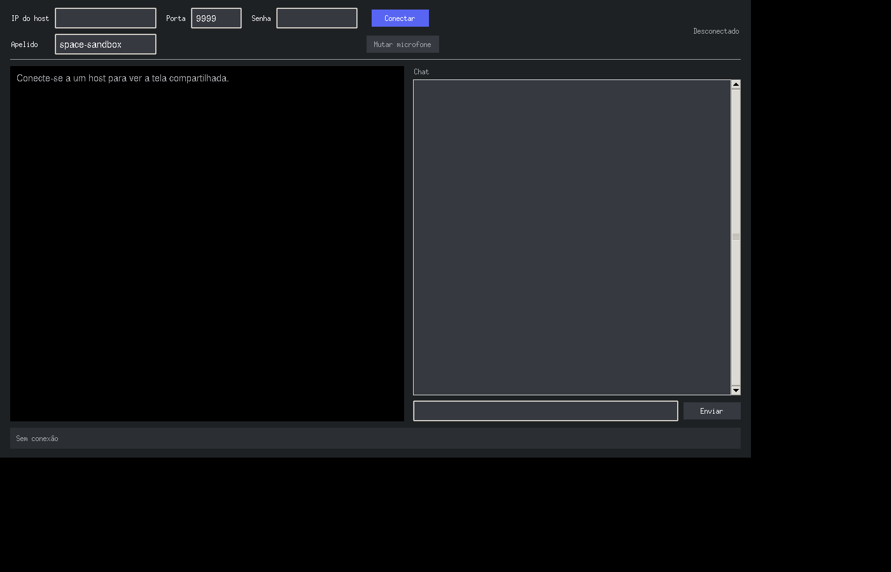
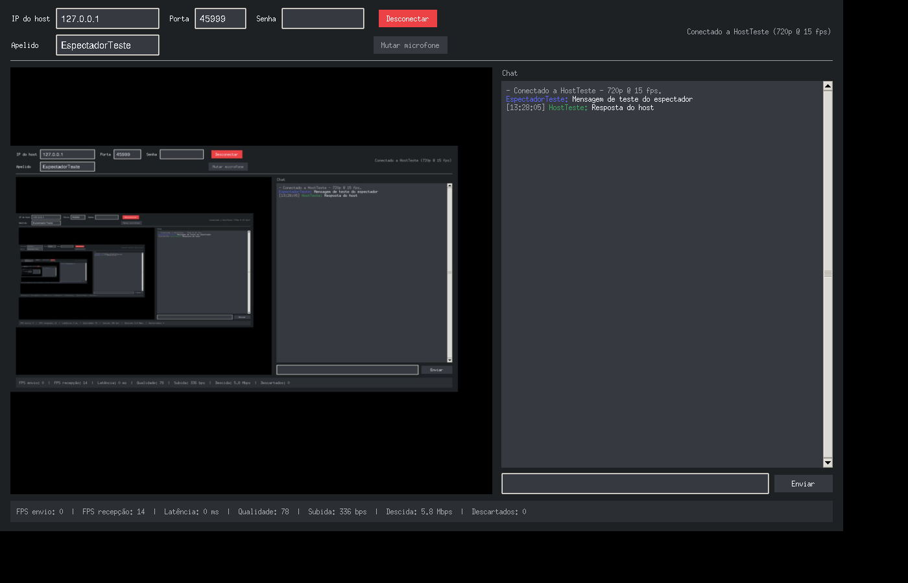

# ScreenShare 1.0

Aplicativo desktop de **compartilhamento de tela ponto a ponto (1:1)** com **áudio bidirecional** e **chat integrado**, escrito 100% em Python com código, comentários e documentação em português.

Projeto acadêmico desenvolvido com foco em arquitetura limpa, modularização e facilidade de manutenção — uma alternativa leve ao compartilhamento de tela do Discord para conversas entre duas pessoas.

---

## Telas

| Menu principal | Janela do host |
| --- | --- |
|  |  |

| Janela do espectador | Sessão ativa (vídeo + chat) |
| --- | --- |
|  |  |

---

## Índice

- [Telas](#telas)
- [Recursos](#recursos)
- [Arquitetura](#arquitetura)
- [Instalação](#instalação)
- [Como usar](#como-usar)
- [Uso pela linha de comando](#uso-pela-linha-de-comando)
- [Gerando o executável](#gerando-o-executável)
- [Testes](#testes)
- [Protocolo de comunicação](#protocolo-de-comunicação)
- [Desempenho e rede](#desempenho-e-rede)
- [Solução de problemas](#solução-de-problemas)
- [Roteiro de evolução](#roteiro-de-evolução)
- [Licença](#licença)

---

## Recursos

| Recurso | Descrição |
| --- | --- |
| Compartilhamento de tela | Captura via `mss`, compressão JPEG, 480p/720p/1080p, 15 a 60 fps |
| Áudio bidirecional | Microfone dos dois lados (44,1 kHz, mono, 16 bits) via `sounddevice`, com PyAudio como alternativa |
| Controles estilo Discord | Botões independentes de **mudo do microfone** e **desativar o som recebido**, com estado visual |
| Prévia da transmissão | O host vê ao vivo o que está enviando, desde o início do compartilhamento |
| Diagnóstico de rede | Lista os IPs da máquina, testa o alcance da porta e libera o firewall do Windows |
| Chat | Mensagens instantâneas nos dois sentidos, com autor e horário |
| Qualidade adaptativa | Reduz a qualidade JPEG e descarta quadros quando a latência sobe |
| Segurança | Senha opcional (token SHA-256), limite de carga útil, sessão exclusiva |
| Reconexão automática | O espectador tenta reconectar automaticamente após quedas |
| Multimonitor | Seleção de monitor específico ou de toda a área de trabalho |
| Estatísticas ao vivo | FPS, latência, qualidade, taxa de subida/descida e quadros descartados |
| Temas | Escuro e claro, com preferências salvas em disco |
| Atalhos | `Ctrl+S` iniciar/parar, `Ctrl+M` mudo do microfone, `Ctrl+D` desativar o som, `Ctrl+Q` sair |
| Multiplataforma | Windows 10/11, Linux (Ubuntu 20.04+) e macOS |

---

## Arquitetura

Modelo cliente-servidor sobre **TCP** (porta padrão **9999**): o **host** compartilha a tela, o **espectador** assiste.

```
        HOST (servidor)                              ESPECTADOR (cliente)
  +-----------------------------+              +-----------------------------+
  | captura_tela  -> compressao |==== VIDEO ==>| compressao -> visualizador  |
  | captura_audio               |<=== AUDIO ==>|               reprodutor    |
  | chat / estado / ping        |<=== CHAT ===>| chat / estado / pong        |
  +-----------------------------+              +-----------------------------+
              sessao.py (threads)                       sessao.py (threads)
```

Organização dos módulos:

```
screenshare/
├── principal.py                 # Ponto de entrada e argumentos de linha de comando
├── configuracao/
│   └── configuracoes.py         # Dataclasses de configuração, temas e persistência JSON
├── nucleo/
│   ├── protocolo.py             # Formato dos quadros, tipos de mensagem, tokens
│   ├── conexao.py               # Socket TCP com envio thread-safe e leitura exata
│   └── sessao.py                # Orquestração das threads de vídeo, áudio, chat e ping
├── midia/
│   ├── captura_tela.py          # Captura multiplataforma (mss) e multimonitor
│   ├── captura_audio.py         # Captura/reprodução (sounddevice ou PyAudio) com fila anti-latência
│   ├── previa.py                # Pré-visualização local da própria transmissão
│   └── compressao.py            # JPEG, conversões de cor e controlador adaptativo
├── aplicacao/
│   ├── servidor.py              # Host: escuta, handshake, autenticação, sessão
│   └── cliente.py               # Espectador: conexão, handshake, reconexão automática
├── interface/
│   ├── tema.py                  # Estilos ttk (tema escuro/claro)
│   ├── componentes.py           # Chat, estatísticas, visualizador e ponte de threads
│   ├── janela_inicial.py        # Menu principal
│   ├── janela_servidor.py       # Janela do host (prévia, controles de áudio, chat)
│   ├── janela_cliente.py        # Janela do espectador
│   └── janela_diagnostico.py    # Diagnóstico de rede, firewall e teste de porta
├── utilitarios/
│   ├── registro.py              # Log rotativo em arquivo e console
│   ├── rede.py                  # IPs locais, diagnóstico de porta, firewall e validações
│   └── recursos.py              # Ícones e caminhos dentro do executável
├── testes/                      # 74 testes automatizados (unitários + integração)
├── build/                       # Scripts de build, spec do PyInstaller e liberação do firewall
└── recursos/                    # Ícones da aplicação
```

Cada camada tem uma responsabilidade única: rede não conhece interface, interface não conhece sockets, e a mídia é isolada em módulos substituíveis. Toda comunicação entre as threads de rede e a interface passa pela classe `PonteInterface`, que evita o uso concorrente (e inseguro) dos widgets do Tkinter.

---

## Instalação

### Requisitos

- Python 3.9 ou superior (testado até o 3.14)
- Tkinter (no Ubuntu/Debian: `sudo apt install python3-tk`)
- PortAudio, apenas para o áudio no Linux (`sudo apt install libportaudio2`). No Windows e no macOS o `sounddevice` já traz a biblioteca.

### Passo a passo

```bash
git clone https://github.com/<seu-usuario>/screenshare.git
cd screenshare

python -m venv .venv
# Windows
.venv\Scripts\activate
# Linux/macOS
source .venv/bin/activate

pip install -r requirements.txt
python principal.py
```

#### Áudio: sounddevice, PyAudio ou nenhum

O áudio usa o **sounddevice**, escolhido por ter pacotes prontos para o Python 3.13/3.14 (o PyAudio ainda não os oferece). O projeto detecta o motor disponível em tempo de execução, nesta ordem:

1. `sounddevice` (preferencial, instalado pelo `requirements.txt`);
2. `pyaudio` (alternativa automática, se já estiver instalado);
3. nenhum: o aplicativo segue funcionando com vídeo e chat, e a interface informa o motivo.

```bash
# Preferencial (qualquer sistema)
pip install sounddevice
# Linux, se aparecer "PortAudio library not found"
sudo apt install libportaudio2
# Alternativa antiga (opcional)
pip install PyAudio
```

A janela inicial e a janela do host mostram qual motor está em uso.

---

## Como usar

### Quem vai compartilhar a tela (host)

1. Abra o aplicativo e clique em **Compartilhar minha tela (ser host)**.
2. Ajuste apelido, porta, senha (opcional), monitor, resolução, fps e qualidade.
3. Clique em **Iniciar compartilhamento**. A **prévia** à direita mostra exatamente o que está sendo transmitido.
4. Clique em **Copiar** e envie o endereço (`IP:porta`) para a outra pessoa.
5. Na primeira execução, abra **Diagnóstico** e clique em **Liberar porta no firewall** (veja abaixo).

Durante a sessão, os botões **Microfone** e **Som** funcionam como no Discord: o primeiro silencia o que você envia; o segundo silencia o que você ouve. Os atalhos são `Ctrl+M` e `Ctrl+D`.

### Quem vai assistir (espectador)

1. Abra o aplicativo e clique em **Assistir a uma tela (ser espectador)**.
2. Cole o endereço recebido no campo **IP do host** (aceita o formato `192.168.0.10:9999`).
3. Informe a senha, se o host tiver definido uma, e clique em **Conectar**.
4. Se a conexão falhar, o aplicativo oferece abrir o **Diagnóstico**, que testa a porta e explica exatamente qual é o problema.

O chat e o microfone funcionam nos dois sentidos durante toda a sessão.

---

## Uso pela linha de comando

```bash
python principal.py                            # abre o menu gráfico
python principal.py --host                     # abre direto como host
python principal.py --assistir 192.168.0.10    # abre direto como espectador
python principal.py --host --console           # host sem interface gráfica
python principal.py --host --resolucao 1080p --fps 30 --senha minhasenha
python principal.py --sem-audio --depurar      # sem áudio, com log detalhado
```

Configurações e logs são gravados em:

- Windows: `%APPDATA%\ScreenShare\`
- Linux: `~/.config/screenshare/`
- macOS: `~/Library/Application Support/ScreenShare/`

---

## Gerando o executável

O PyInstaller **não faz compilação cruzada**: gere o `.exe` no Windows e o binário Linux no Linux.

### Windows (gera `dist\ScreenShare.exe`)

```bat
build\gerar_executavel_windows.bat
```

### Linux (gera `dist/ScreenShare`)

```bash
bash build/gerar_executavel_linux.sh
```

### Manualmente

```bash
pip install pyinstaller
pyinstaller build/screenshare.spec --noconfirm --clean
```

Os scripts criam o ambiente virtual, instalam as dependências, rodam os testes e empacotam tudo em um único arquivo (sem console, com ícone e recursos embutidos).

---

## Testes

```bash
python -m unittest discover -s testes -p "teste_*.py" -v
```

Cobertura dos testes (74 casos):

- `teste_protocolo.py` — empacotamento/desempacotamento, JSON, tokens e conexão TCP real
- `teste_midia.py` — compressão JPEG, conversões, redimensionamento e qualidade adaptativa
- `teste_configuracoes.py` — padrões, persistência, arquivos corrompidos e validações de rede
- `teste_integracao.py` — handshake, senha correta/incorreta, chat bidirecional, vídeo, sessão exclusiva, desconexão e controles de áudio
- `teste_audio.py` — detecção de motor, captura, reprodução, descarte de blocos e ausência total de áudio (motores simulados)
- `teste_rede.py` — classificação de IPs, teste de alcance de porta e mensagens de diagnóstico
- `teste_previa.py` — dimensões reduzidas, entrega de quadros e falha de captura da prévia

Os testes de integração usam dublês para captura de tela e áudio, portanto rodam em qualquer ambiente (inclusive em CI sem monitor nem placa de som).

---

## Protocolo de comunicação

Cada quadro transmitido no socket segue o formato:

```
+----------+--------+-------------+-----------------+
| 2 bytes  | 1 byte |   4 bytes   |    N bytes      |
|  "SS"    |  tipo  |  tamanho N  |   carga útil    |
+----------+--------+-------------+-----------------+
```

Tipos de mensagem:

| Código | Tipo | Carga útil |
| --- | --- | --- |
| 1 / 2 / 3 | `HANDSHAKE_PEDIDO` / `ACEITO` / `RECUSADO` | JSON com versão, apelido e token |
| 4 | `PRONTO` | vazia |
| 10 | `VIDEO` | quadro JPEG |
| 11 | `AUDIO` | bloco PCM 16 bits |
| 20 | `CHAT` | JSON `{autor, conteudo, horario}` |
| 30 / 31 | `PING` / `PONG` | JSON `{t}` para medir latência |
| 40 | `ESTADO` | JSON com mudanças (ex.: microfone) |
| 50 | `ENCERRAR` | JSON `{motivo}` |

Fluxo de conexão:

```
Espectador -> Host: HANDSHAKE_PEDIDO (versão + apelido + token SHA-256)
Host -> Espectador: HANDSHAKE_ACEITO (resolução, fps, áudio) ou HANDSHAKE_RECUSADO
Espectador -> Host: PRONTO
Host -> Espectador: fluxo contínuo de VIDEO/AUDIO; ambos trocam CHAT/PING/PONG
```

Segurança implementada: senha convertida em token SHA-256, comparação resistente a ataques de tempo (`hmac.compare_digest`), limite de 10 MB por carga útil, uma sessão exclusiva por vez e validação estrita do prefixo mágico e dos tipos de mensagem.

---

## Desempenho e rede

| Configuração | Banda de subida | Observação |
| --- | --- | --- |
| 480p @ 30 fps | ~1,5–3 Mbps | ideal para internet doméstica |
| 720p @ 30 fps | ~3–5 Mbps | padrão recomendado |
| 1080p @ 30 fps | ~8–12 Mbps | ideal para rede local |
| Áudio (por lado) | ~700 kbps | 44,1 kHz, mono, 16 bits |

- Uso de CPU no host: ~20–35% em um i5 moderno (captura + compressão).
- Latência esperada em rede local: abaixo de 200 ms; medida ao vivo pelo `PING`/`PONG`.
- Acima de 200 ms a qualidade JPEG cai automaticamente; acima de 400 ms quadros são descartados para manter o tempo real.

### Uso pela internet

1. Libere a porta 9999/TCP no firewall do host, ou
2. **Recomendado:** use uma VPN ponto a ponto como [Tailscale](https://tailscale.com/) ou [ZeroTier](https://www.zerotier.com/) e informe o IP da VPN — assim não é necessário abrir portas no roteador.

No Windows, a primeira execução pode exibir o alerta do Firewall: escolha **Permitir acesso** em redes privadas.

---

## Solução de problemas

| Sintoma | Causa provável | Solução |
| --- | --- | --- |
| `Tkinter não está disponível` | Python sem Tk | `sudo apt install python3-tk` |
| `Áudio indisponível` na interface | sounddevice/PortAudio ausente | `pip install sounddevice` e, no Linux, `sudo apt install libportaudio2` |
| `Não foi possível escutar na porta 9999` | porta ocupada | mude a porta na interface ou use `--porta 9100` |
| `Tempo esgotado` ao conectar | firewall do host bloqueando a porta, ou IP errado | veja a seção **Erro de tempo esgotado** abaixo |
| `O host recusou a conexão` | o host ainda não clicou em Iniciar compartilhamento | inicie o compartilhamento no host e confira a porta |
| Espectador não conecta | firewall ou IP externo | libere a porta ou use Tailscale/ZeroTier |
| `Senha incorreta` | senhas diferentes nos dois lados | confira o campo Senha em ambos |
| Tela preta no espectador | monitor errado selecionado | escolha outro monitor na lista |
| Vídeo travando | banda insuficiente | reduza a resolução/fps ou mantenha a qualidade adaptativa ligada |
| Falha de captura no macOS | permissão do sistema | Ajustes → Privacidade → Gravação de Tela |
| Falha de captura no Linux/Wayland | mss requer X11 | inicie a sessão em Xorg |

### Erro de tempo esgotado (o mais comum)

"Tempo esgotado" significa que o pacote do espectador **não chegou** ao aplicativo do host. A ordem de verificação é sempre a mesma:

1. **Firewall do Windows.** É a causa mais frequente. No host, clique com o botão direito em `build/liberar_firewall_windows.bat` e escolha **Executar como administrador** (ou use o botão **Liberar porta no firewall** dentro do **Diagnóstico**). O script cria a regra:

   ```bat
   netsh advfirewall firewall add rule name="ScreenShare 9999" dir=in action=allow protocol=TCP localport=9999
   ```

2. **Endereço IP errado.** Se o host tiver VPN (Tailscale, ZeroTier), Docker, VirtualBox ou WSL, o endereço padrão pode ser de um adaptador virtual inalcançável. Abra **Diagnóstico → Meus endereços** e use o endereço marcado como **rede local (recomendado)**.

3. **Redes diferentes.** As duas máquinas precisam estar na mesma rede local. Wi-Fi de visitantes e isolamento de clientes (AP isolation) bloqueiam a conexão. Pela internet, use Tailscale/ZeroTier nas duas pontas.

4. **Antivírus.** Alguns antivírus bloqueiam conexões de entrada mesmo com a regra do firewall criada; adicione uma exceção para o `ScreenShare.exe`.

Para confirmar rapidamente onde está o problema, use **Diagnóstico → Testar conexão**: "recusada" indica que a rede está boa e falta iniciar o compartilhamento; "tempo esgotado" indica bloqueio ou endereço errado.

No Linux, libere a porta com `sudo ufw allow 9999/tcp`.

Logs detalhados: `~/.config/screenshare/screenshare.log` (Linux) ou `%APPDATA%\ScreenShare\screenshare.log` (Windows). Use `--depurar` para o nível DEBUG.

---

## Roteiro de evolução

- [ ] Codec H.264 (via PyAV) para reduzir consumo de banda
- [ ] Compartilhamento de janela específica, não apenas do monitor inteiro
- [ ] Envio de arquivos pelo chat
- [ ] Suporte a mais de um espectador simultâneo
- [ ] Controle remoto do mouse e teclado (com autorização)
- [ ] Criptografia TLS do canal (atualmente apenas autenticação por token)
- [ ] Gravação local da sessão em vídeo

---

## Licença

Distribuído sob a licença MIT — consulte o arquivo [LICENSE](LICENSE).

Desenvolvido por **Moises M Santos** — Goiânia/GO, Brasil.

---

## Documentação adicional

- [docs/ARQUITETURA.md](docs/ARQUITETURA.md) — camadas, modelo de threads, pipelines de vídeo/áudio, decisões de projeto e pontos de extensão.
- [CHANGELOG.md](CHANGELOG.md) — histórico de versões.
